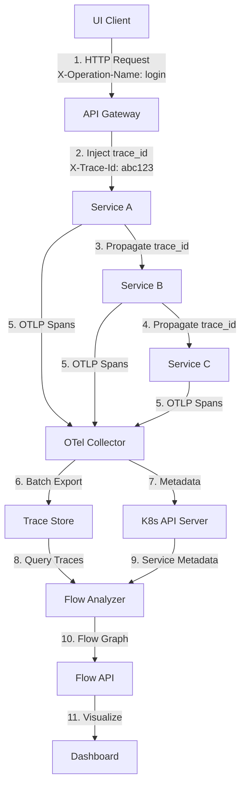
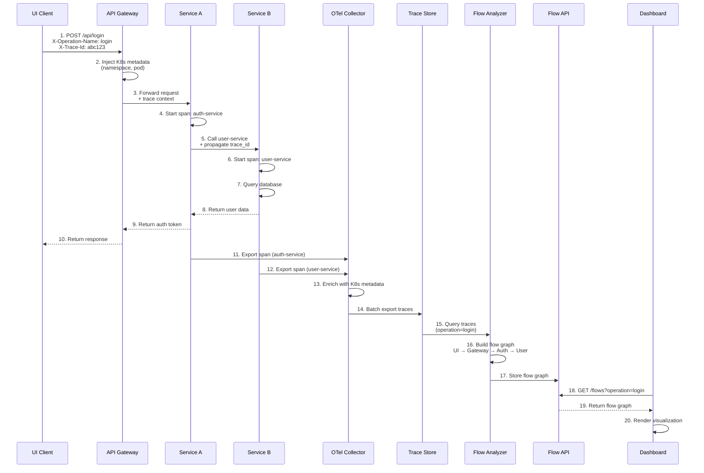

# Kubernetes-Native Distributed Tracing System Architecture

## Executive Summary

This document describes a Kubernetes-native system for automatically tracking and visualizing microservice request flows triggered by UI operations. The system uses OpenTelemetry for instrumentation, leverages Kubernetes metadata for service discovery, and provides real-time visualization of service dependencies and request flows.

---

## 1. High Level Architecture

### 1.1 System Overview

```
┌─────────────────────────────────────────────────────────────────┐
│                         UI Layer                                 │
│  ┌──────────────┐  ┌──────────────┐  ┌──────────────┐          │
│  │   Browser    │  │   Mobile     │  │   CLI/API    │          │
│  │   Client     │  │   Client     │  │   Client     │          │
│  └──────┬───────┘  └──────┬───────┘  └──────┬───────┘          │
│         │                  │                  │                  │
│         └──────────────────┼──────────────────┘                  │
│                            │                                     │
│                   ┌─────────▼─────────┐                          │
│                   │  API Gateway      │                          │
│                   │  (Ingress/Envoy)  │                          │
│                   └─────────┬─────────┘                          │
└────────────────────────────┼─────────────────────────────────────┘
                             │
                             │ trace_id propagation
                             │
┌────────────────────────────▼─────────────────────────────────────┐
│                    Kubernetes Cluster                            │
│                                                                  │
│  ┌──────────────────────────────────────────────────────────┐    │
│  │              Service Mesh (Optional)                     │    │
│  │  ┌──────────┐  ┌──────────┐  ┌──────────┐                │    │
│  │  │ Istio    │  │ Linkerd  │  │ Consul   │                │    │
│  │  └──────────┘  └──────────┘  └──────────┘                │    │
│  └──────────────────────────────────────────────────────────┘    │
│                                                                  │
│  ┌──────────────────────────────────────────────────────────┐    │
│  │              Microservices (Auto-Instrumented)           │    │
│  │  ┌──────────┐  ┌──────────┐  ┌──────────┐                │    │
│  │  │ Service A│──▶│ Service B│──▶│ Service C│              │    │
│  │  └────┬─────┘  └────┬─────┘  └────┬─────┘                │    │
│  │       │             │             │                       │   │
│  │       └─────────────┼─────────────┘                       │   │
│  │                     │                                     │   │
│  │              ┌───────▼───────┐                            │   │
│  │              │ OpenTelemetry │                            │   │
│  │              │   Collector   │                            │   │
│  │              │   (DaemonSet) │                            │   │
│  │              └───────┬───────┘                            │   │
│  └──────────────────────┼────────────────────────────────────┘   │
│                         │                                         │
│                         │ OTLP (gRPC/HTTP)                       │
│                         │                                         │
└─────────────────────────┼─────────────────────────────────────────┘
                          │
                          │
┌─────────────────────────▼─────────────────────────────────────────┐
│              Observability Backend                                 │
│                                                                     │
│  ┌──────────────────┐  ┌──────────────────┐  ┌─────────────────┐ │
│  │   Trace Store    │  │  Flow Analyzer   │  │  Metadata       │ │
│  │   (Tempo/Jaeger) │  │   (Custom)       │  │  Enricher       │ │
│  └────────┬─────────┘  └────────┬─────────┘  └────────┬────────┘ │
│           │                     │                     │           │
│           └─────────────────────┼─────────────────────┘           │
│                                 │                                 │
│                      ┌──────────▼──────────┐                      │
│                      │   Flow API Server   │                      │
│                      │   (GraphQL/REST)    │                      │
│                      └──────────┬──────────┘                      │
└─────────────────────────────────┼─────────────────────────────────┘
                                  │
                                  │
┌─────────────────────────────────▼─────────────────────────────────┐
│                    Visualization Layer                            │
│                                                                     │
│  ┌──────────────────────────────────────────────────────────┐    │
│  │              Flow Visualization Dashboard                 │    │
│  │  • Service Dependency Graph                               │    │
│  │  • Request Flow Timeline                                  │    │
│  │  • Error & Latency Heatmap                                │    │
│  │  • Operation-based Filtering                              │    │
│  └──────────────────────────────────────────────────────────┘    │
└───────────────────────────────────────────────────────────────────┘
```

### 1.2 Component Interaction Flow



---

## 2. Component Responsibilities

### 2.1 UI Instrumentation Layer

**Purpose**: Capture UI events and inject operation context

**Components**:
- **Browser SDK**: JavaScript library for UI event tracking
- **Mobile SDK**: Native SDKs for iOS/Android
- **Operation Context**: Automatically tags requests with operation names

**Responsibilities**:
- Inject `X-Operation-Name` header based on UI action
- Generate or propagate `X-Trace-Id` header
- Capture UI event metadata (button click, form submit, etc.)
- Send initial span to collector

**Implementation**:
```javascript
// Browser SDK Example
class UITracer {
  trackOperation(operationName, uiEvent) {
    const traceId = this.generateTraceId();
    const span = {
      name: operationName,
      attributes: {
        'ui.event': uiEvent,
        'ui.timestamp': Date.now(),
        'ui.user_agent': navigator.userAgent
      }
    };
    this.injectHeaders(traceId, operationName);
    this.sendSpan(span);
  }
}
```

### 2.2 API Gateway Layer

**Purpose**: Entry point for all requests, initial trace context

**Components**:
- **Ingress Controller**: Nginx/Envoy/Traefik
- **Trace Injector**: Middleware for trace context injection

**Responsibilities**:
- Validate and propagate trace context
- Inject Kubernetes metadata (namespace, pod)
- Rate limiting and security
- Request/response logging

**Configuration**:
```yaml
# Envoy Trace Configuration
tracing:
  http:
    name: envoy.tracers.opentelemetry
    typed_config:
      "@type": type.googleapis.com/envoy.config.trace.v3.OpenTelemetryConfig
      grpc_service:
        envoy_grpc:
          cluster_name: otel-collector
```

### 2.3 Service Mesh Layer (Optional)

**Purpose**: Automatic instrumentation for services without code changes

**Components**:
- **Service Mesh**: Istio/Linkerd/Consul Connect
- **Sidecar Proxies**: Envoy/Linkerd-proxy

**Responsibilities**:
- Automatic span generation for service-to-service calls
- Load balancing with trace context
- Circuit breaking and retry logic
- mTLS for secure communication

**Benefits**:
- Zero-code instrumentation
- Automatic retry tracking
- Network-level observability

### 2.4 Microservice Layer

**Purpose**: Business logic execution with automatic tracing

**Components**:
- **Application Services**: Business logic containers
- **OpenTelemetry SDK**: Language-specific instrumentation
- **Auto-Instrumentation**: Automatic middleware injection

**Responsibilities**:
- Execute business logic
- Propagate trace context to downstream services
- Generate spans for operations
- Capture service metadata (name, version, namespace)

**Auto-Instrumentation**:
```python
# Python Example
from opentelemetry import trace
from opentelemetry.instrumentation.requests import RequestsInstrumentor
from opentelemetry.sdk.resources import Resource
from opentelemetry.sdk.trace import TracerProvider

# Auto-instrument HTTP requests
RequestsInstrumentor().instrument()

# Configure resource with K8s metadata
resource = Resource.create({
    "service.name": os.getenv("SERVICE_NAME"),
    "k8s.namespace": os.getenv("NAMESPACE"),
    "k8s.pod.name": os.getenv("HOSTNAME"),
})
```

### 2.5 OpenTelemetry Collector

**Purpose**: Centralized trace collection and processing

**Components**:
- **OTel Collector**: DaemonSet in each node
- **Receivers**: OTLP, Jaeger, Zipkin
- **Processors**: Batch, Resource, K8s Attributes
- **Exporters**: Tempo, Jaeger, custom backend

**Responsibilities**:
- Receive traces from all services
- Enrich with Kubernetes metadata
- Batch and compress traces
- Route to storage backends
- Filter sensitive data (PII masking)

**Configuration**:
```yaml
receivers:
  otlp:
    protocols:
      grpc:
        endpoint: 0.0.0.0:4317
      http:
        endpoint: 0.0.0.0:4318

processors:
  batch:
    timeout: 1s
    send_batch_size: 1024
  
  resource:
    attributes:
      - key: k8s.namespace
        from_attribute: k8s.namespace.name
      - key: k8s.pod.name
        from_attribute: k8s.pod.name
      - key: environment
        value: ${ENVIRONMENT}

  k8sattributes:
    auth_type: serviceAccount
    passthrough: false
    extract:
      metadata:
        - namespace
        - podName
        - podUID
        - nodeName
      labels:
        - tag_name: app
          key: app.kubernetes.io/name
        - tag_name: version
          key: app.kubernetes.io/version

exporters:
  otlp/tempo:
    endpoint: tempo:4317
    tls:
      insecure: false
```

### 2.6 Trace Storage Layer

**Purpose**: Long-term trace storage and querying

**Components**:
- **Tempo**: Grafana's trace backend (recommended)
- **Jaeger**: Alternative trace backend
- **Object Storage**: S3/GCS/MinIO for trace data

**Responsibilities**:
- Store trace data efficiently
- Index traces by operation, service, time
- Support trace queries and searches
- Retention policies

### 2.7 Flow Analyzer

**Purpose**: Analyze traces and build service dependency graphs

**Components**:
- **Trace Processor**: Analyzes trace data
- **Graph Builder**: Constructs service dependency graphs
- **Flow Aggregator**: Groups traces by operation

**Responsibilities**:
- Extract service call sequences from traces
- Build directed dependency graphs
- Identify failure patterns
- Calculate latency percentiles
- Detect retries and circuit breaks

**Algorithm**:
```python
class FlowAnalyzer:
    def analyze_trace(self, trace):
        # Extract spans and build call graph
        spans = trace.spans
        graph = DirectedGraph()
        
        for span in spans:
            service = span.attributes['service.name']
            parent = span.parent_span_id
            
            graph.add_node(service, {
                'namespace': span.attributes['k8s.namespace'],
                'pod': span.attributes['k8s.pod.name'],
                'latency': span.duration,
                'status': span.status
            })
            
            if parent:
                parent_service = self.get_service_by_span_id(parent)
                graph.add_edge(parent_service, service)
        
        return graph
```

### 2.8 Flow API Server

**Purpose**: REST/GraphQL API for flow visualization

**Components**:
- **REST API**: Standard HTTP endpoints
- **GraphQL API**: Flexible query interface
- **WebSocket**: Real-time flow updates

**Responsibilities**:
- Serve flow graphs to frontend
- Filter flows by operation, service, time
- Provide trace details
- Real-time updates for active flows

### 2.9 Visualization Dashboard

**Purpose**: User interface for flow visualization

**Components**:
- **Flow Graph View**: Interactive service dependency graph
- **Timeline View**: Chronological request flow
- **Operation Filter**: Filter by UI operation
- **Error Dashboard**: Failure analysis

**Responsibilities**:
- Render service dependency graphs
- Show request flow timelines
- Highlight errors and latency issues
- Filter and search capabilities

---

## 3. Request Lifecycle Sequence Diagram



---

## 4. Data Model

### 4.1 Trace Data Model

```typescript
interface Trace {
  traceId: string;                    // Unique trace identifier
  operationName: string;              // UI operation (login, create_vm, etc.)
  uiEvent?: string;                   // UI event that triggered (button_click, form_submit)
  startTime: number;                   // Unix timestamp (nanoseconds)
  endTime: number;
  duration: number;                    // Duration in nanoseconds
  status: 'success' | 'error' | 'timeout';
  spans: Span[];
  metadata: {
    environment: string;              // dev/stage/prod
    user?: string;                    // Masked user ID
    sessionId?: string;
  };
}

interface Span {
  spanId: string;
  parentSpanId?: string;
  traceId: string;
  name: string;                       // Operation name
  service: ServiceInfo;
  startTime: number;
  endTime: number;
  duration: number;
  status: SpanStatus;
  attributes: Record<string, string | number | boolean>;
  events: SpanEvent[];
  links?: SpanLink[];
}

interface ServiceInfo {
  name: string;                       // Service name
  namespace: string;                  // K8s namespace
  pod: string;                        // Pod name
  version?: string;                   // Service version
  deployment?: string;                // Deployment name
}

interface SpanStatus {
  code: 'OK' | 'ERROR' | 'UNSET';
  message?: string;
}

interface SpanEvent {
  name: string;
  timestamp: number;
  attributes?: Record<string, any>;
}

interface SpanLink {
  traceId: string;
  spanId: string;
}
```

### 4.2 Flow Graph Data Model

```typescript
interface FlowGraph {
  flowId: string;
  operationName: string;
  traceId: string;
  startTime: number;
  endTime: number;
  nodes: FlowNode[];
  edges: FlowEdge[];
  metadata: FlowMetadata;
}

interface FlowNode {
  id: string;                         // Service identifier
  service: ServiceInfo;
  metrics: {
    requestCount: number;
    errorCount: number;
    avgLatency: number;
    p50Latency: number;
    p95Latency: number;
    p99Latency: number;
  };
  status: 'healthy' | 'degraded' | 'down';
}

interface FlowEdge {
  from: string;                       // Source service ID
  to: string;                         // Target service ID
  callCount: number;
  errorRate: number;
  avgLatency: number;
  retryCount?: number;
}

interface FlowMetadata {
  environment: string;
  operationName: string;
  uiEvent?: string;
  totalDuration: number;
  totalSpans: number;
  errorCount: number;
}
```

### 4.3 Database Schema

```sql
-- Traces table (for metadata, actual traces in Tempo)
CREATE TABLE traces (
    trace_id VARCHAR(64) PRIMARY KEY,
    operation_name VARCHAR(255) NOT NULL,
    ui_event VARCHAR(255),
    start_time TIMESTAMP NOT NULL,
    end_time TIMESTAMP NOT NULL,
    duration BIGINT NOT NULL,
    status VARCHAR(20) NOT NULL,
    environment VARCHAR(50) NOT NULL,
    user_id VARCHAR(255),
    session_id VARCHAR(255),
    INDEX idx_operation (operation_name, start_time),
    INDEX idx_environment (environment, start_time),
    INDEX idx_status (status, start_time)
);

-- Flow graphs table
CREATE TABLE flow_graphs (
    flow_id VARCHAR(64) PRIMARY KEY,
    trace_id VARCHAR(64) NOT NULL,
    operation_name VARCHAR(255) NOT NULL,
    graph_data JSONB NOT NULL,
    created_at TIMESTAMP DEFAULT CURRENT_TIMESTAMP,
    INDEX idx_operation (operation_name, created_at),
    FOREIGN KEY (trace_id) REFERENCES traces(trace_id)
);

-- Service dependencies table
CREATE TABLE service_dependencies (
    id BIGSERIAL PRIMARY KEY,
    source_service VARCHAR(255) NOT NULL,
    target_service VARCHAR(255) NOT NULL,
    source_namespace VARCHAR(255) NOT NULL,
    target_namespace VARCHAR(255) NOT NULL,
    operation_name VARCHAR(255),
    call_count BIGINT DEFAULT 0,
    error_count BIGINT DEFAULT 0,
    avg_latency_ms BIGINT,
    last_seen TIMESTAMP DEFAULT CURRENT_TIMESTAMP,
    UNIQUE(source_service, target_service, source_namespace, target_namespace, operation_name),
    INDEX idx_source (source_service, source_namespace),
    INDEX idx_target (target_service, target_namespace)
);
```

---

## 5. Backend API Design

### 5.1 REST API Endpoints

#### 5.1.1 Flow Queries

```http
# Get flows by operation
GET /api/v1/flows?operation={operationName}&startTime={timestamp}&endTime={timestamp}&environment={env}

Response:
{
  "flows": [
    {
      "flowId": "flow-123",
      "operationName": "login",
      "traceId": "abc123",
      "startTime": 1234567890,
      "endTime": 1234567900,
      "duration": 10000000,
      "nodes": [...],
      "edges": [...],
      "status": "success"
    }
  ],
  "total": 100,
  "page": 1,
  "pageSize": 20
}

# Get specific flow graph
GET /api/v1/flows/{flowId}

Response:
{
  "flowId": "flow-123",
  "graph": {
    "nodes": [
      {
        "id": "api-gateway",
        "service": {
          "name": "api-gateway",
          "namespace": "gateway",
          "pod": "api-gateway-abc123"
        },
        "metrics": {
          "requestCount": 1000,
          "errorCount": 5,
          "avgLatency": 50,
          "p95Latency": 120
        }
      }
    ],
    "edges": [
      {
        "from": "api-gateway",
        "to": "auth-service",
        "callCount": 1000,
        "errorRate": 0.005,
        "avgLatency": 30
      }
    ]
  }
}

# Get service dependency graph
GET /api/v1/dependencies?namespace={namespace}&service={serviceName}

Response:
{
  "nodes": [...],
  "edges": [...],
  "metadata": {
    "namespace": "production",
    "service": "auth-service",
    "lastUpdated": "2024-01-15T10:00:00Z"
  }
}
```

#### 5.1.2 Trace Queries

```http
# Search traces
GET /api/v1/traces?operation={operationName}&service={serviceName}&status={status}&startTime={timestamp}&endTime={timestamp}

Response:
{
  "traces": [
    {
      "traceId": "abc123",
      "operationName": "login",
      "startTime": 1234567890,
      "duration": 10000000,
      "status": "success",
      "spanCount": 5,
      "serviceCount": 3
    }
  ],
  "total": 50
}

# Get trace details
GET /api/v1/traces/{traceId}

Response:
{
  "traceId": "abc123",
  "operationName": "login",
  "spans": [
    {
      "spanId": "span-1",
      "name": "auth-service.login",
      "service": {
        "name": "auth-service",
        "namespace": "backend",
        "pod": "auth-service-xyz"
      },
      "startTime": 1234567890,
      "duration": 5000000,
      "status": "OK",
      "attributes": {
        "http.method": "POST",
        "http.status_code": 200
      }
    }
  ]
}
```

#### 5.1.3 Operations

```http
# List all operations
GET /api/v1/operations?environment={env}

Response:
{
  "operations": [
    {
      "name": "login",
      "count": 10000,
      "errorRate": 0.01,
      "avgLatency": 150,
      "lastSeen": "2024-01-15T10:00:00Z"
    },
    {
      "name": "create_vm",
      "count": 5000,
      "errorRate": 0.02,
      "avgLatency": 2000
    }
  ]
}

# Get operation statistics
GET /api/v1/operations/{operationName}/stats?startTime={timestamp}&endTime={timestamp}

Response:
{
  "operationName": "login",
  "period": {
    "start": "2024-01-15T00:00:00Z",
    "end": "2024-01-15T23:59:59Z"
  },
  "stats": {
    "totalRequests": 100000,
    "successCount": 99000,
    "errorCount": 1000,
    "avgLatency": 150,
    "p50Latency": 120,
    "p95Latency": 300,
    "p99Latency": 500,
    "services": [
      {
        "name": "auth-service",
        "requestCount": 100000,
        "errorCount": 500
      }
    ]
  }
}
```

#### 5.1.4 Services

```http
# List services
GET /api/v1/services?namespace={namespace}&environment={env}

Response:
{
  "services": [
    {
      "name": "auth-service",
      "namespace": "backend",
      "environment": "production",
      "podCount": 5,
      "version": "v1.2.3",
      "status": "healthy",
      "metrics": {
        "requestRate": 1000,
        "errorRate": 0.01,
        "avgLatency": 50
      }
    }
  ]
}

# Get service details
GET /api/v1/services/{serviceName}?namespace={namespace}

Response:
{
  "service": {
    "name": "auth-service",
    "namespace": "backend",
    "pods": [
      {
        "name": "auth-service-abc123",
        "node": "node-1",
        "status": "Running"
      }
    ],
    "dependencies": {
      "upstream": ["api-gateway"],
      "downstream": ["user-service", "session-service"]
    },
    "metrics": {
      "requestRate": 1000,
      "errorRate": 0.01,
      "avgLatency": 50
    }
  }
}
```

### 5.2 GraphQL API

```graphql
type Query {
  # Flow queries
  flows(
    operation: String
    startTime: Int
    endTime: Int
    environment: String
    limit: Int
    offset: Int
  ): FlowConnection!
  
  flow(flowId: ID!): Flow
  
  # Trace queries
  traces(
    operation: String
    service: String
    status: TraceStatus
    startTime: Int
    endTime: Int
  ): TraceConnection!
  
  trace(traceId: ID!): Trace
  
  # Operation queries
  operations(environment: String): [Operation!]!
  operation(name: String!): Operation
  
  # Service queries
  services(namespace: String, environment: String): [Service!]!
  service(name: String!, namespace: String!): Service
  
  # Dependency queries
  dependencies(
    namespace: String
    service: String
  ): DependencyGraph!
}

type Flow {
  id: ID!
  operationName: String!
  traceId: ID!
  startTime: Int!
  endTime: Int!
  duration: Int!
  status: FlowStatus!
  graph: FlowGraph!
  metadata: FlowMetadata!
}

type FlowGraph {
  nodes: [FlowNode!]!
  edges: [FlowEdge!]!
}

type FlowNode {
  id: ID!
  service: ServiceInfo!
  metrics: NodeMetrics!
  status: NodeStatus!
}

type FlowEdge {
  from: ID!
  to: ID!
  callCount: Int!
  errorRate: Float!
  avgLatency: Int!
}

type Trace {
  id: ID!
  operationName: String!
  startTime: Int!
  endTime: Int!
  duration: Int!
  status: TraceStatus!
  spans: [Span!]!
}

type Span {
  id: ID!
  name: String!
  service: ServiceInfo!
  startTime: Int!
  duration: Int!
  status: SpanStatus!
  attributes: JSON!
  parentSpanId: ID
}

type ServiceInfo {
  name: String!
  namespace: String!
  pod: String!
  version: String
}

type Operation {
  name: String!
  count: Int!
  errorRate: Float!
  avgLatency: Int!
  lastSeen: Int!
}

type Service {
  name: String!
  namespace: String!
  environment: String!
  pods: [Pod!]!
  dependencies: ServiceDependencies!
  metrics: ServiceMetrics!
}

type DependencyGraph {
  nodes: [ServiceNode!]!
  edges: [DependencyEdge!]!
}
```

### 5.3 WebSocket API (Real-time Updates)

```typescript
// WebSocket connection for real-time flow updates
interface WebSocketMessage {
  type: 'flow_start' | 'flow_update' | 'flow_complete' | 'error';
  data: FlowUpdate | ErrorEvent;
}

interface FlowUpdate {
  flowId: string;
  operationName: string;
  currentService: string;
  progress: number;  // 0-100
  elapsedTime: number;
}

// Client subscription
ws.send({
  type: 'subscribe',
  filters: {
    operation: 'login',
    environment: 'production'
  }
});
```

---

## 6. UI Wireframe

### 6.1 Main Dashboard Layout

```
┌─────────────────────────────────────────────────────────────────┐
│  Flow Visualization Dashboard                          [User] [⚙️]│
├─────────────────────────────────────────────────────────────────┤
│                                                                   │
│  ┌──────────────────────────────────────────────────────────┐  │
│  │  Filters                                                  │  │
│  │  ┌────────────┐ ┌────────────┐ ┌────────────┐          │  │
│  │  │ Operation  │ │ Environment│ │ Time Range │          │  │
│  │  │ [login ▼] │ │ [prod  ▼] │ │ [Last 1h▼]│          │  │
│  │  └────────────┘ └────────────┘ └────────────┘          │  │
│  │  ┌────────────┐ ┌────────────┐                         │  │
│  │  │ Service    │ │ Status    │                         │  │
│  │  │ [All   ▼] │ │ [All   ▼] │                         │  │
│  │  └────────────┘ └────────────┘                         │  │
│  └──────────────────────────────────────────────────────────┘  │
│                                                                   │
│  ┌──────────────────────────────────────────────────────────┐  │
│  │  Service Dependency Graph                                │  │
│  │                                                           │  │
│  │      [UI Client]                                         │  │
│  │         │                                                │  │
│  │         ▼                                                │  │
│  │    [API Gateway] ──────┐                                │  │
│  │         │              │                                │  │
│  │         ▼              ▼                                │  │
│  │   [Auth Service]  [User Service]                        │  │
│  │         │              │                                │  │
│  │         └──────┬───────┘                                │  │
│  │                ▼                                        │  │
│  │          [DB Service]                                   │  │
│  │                                                           │  │
│  │  Legend: ● Healthy  ⚠ Degraded  ✗ Down                │  │
│  └──────────────────────────────────────────────────────────┘  │
│                                                                   │
│  ┌──────────────────────────────────────────────────────────┐  │
│  │  Request Flow Timeline                                   │  │
│  │                                                           │  │
│  │  Operation: login | Trace ID: abc123                     │  │
│  │                                                           │  │
│  │  UI Client        ████████                               │  │
│  │  API Gateway      ████████████                           │  │
│  │  Auth Service     ████████████████                       │  │
│  │  User Service      ██████████                             │  │
│  │  DB Service        ██████                                 │  │
│  │                                                           │  │
│  │  0ms    50ms   100ms   150ms   200ms                     │  │
│  └──────────────────────────────────────────────────────────┘  │
│                                                                   │
│  ┌──────────────────────────────────────────────────────────┐  │
│  │  Statistics                                               │  │
│  │  ┌──────────┐ ┌──────────┐ ┌──────────┐ ┌──────────┐    │  │
│  │  │ Total    │ │ Success  │ │ Errors   │ │ Avg      │    │  │
│  │  │ Requests │ │ Rate     │ │ Rate     │ │ Latency  │    │  │
│  │  │ 10,000   │ │ 99.5%    │ │ 0.5%     │ │ 150ms    │    │  │
│  │  └──────────┘ └──────────┘ └──────────┘ └──────────┘    │  │
│  └──────────────────────────────────────────────────────────┘  │
└─────────────────────────────────────────────────────────────────┘
```

### 6.2 Flow Detail View

```
┌─────────────────────────────────────────────────────────────────┐
│  Flow Details: login (abc123)                          [← Back] │
├─────────────────────────────────────────────────────────────────┤
│                                                                   │
│  ┌──────────────────────────────────────────────────────────┐  │
│  │  Flow Information                                         │  │
│  │  Operation: login                                         │  │
│  │  Trace ID: abc123                                         │  │
│  │  Status: ✓ Success                                        │  │
│  │  Duration: 150ms                                          │  │
│  │  Start Time: 2024-01-15 10:00:00                         │  │
│  │  Environment: production                                  │  │
│  └──────────────────────────────────────────────────────────┘  │
│                                                                   │
│  ┌──────────────────────────────────────────────────────────┐  │
│  │  Service Call Sequence                                    │  │
│  │                                                           │  │
│  │  1. UI Client                                            │  │
│  │     └─> POST /api/login                                 │  │
│  │         Duration: 5ms                                    │  │
│  │                                                           │  │
│  │  2. API Gateway (gateway/api-gateway-abc)                │  │
│  │     └─> Forward to auth-service                          │  │
│  │         Duration: 10ms                                   │  │
│  │                                                           │  │
│  │  3. Auth Service (backend/auth-service-xyz)              │  │
│  │     ├─> Validate credentials                             │  │
│  │     └─> Call user-service                                │  │
│  │         Duration: 80ms                                   │  │
│  │                                                           │  │
│  │  4. User Service (backend/user-service-def)              │  │
│  │     └─> Query database                                   │  │
│  │         Duration: 50ms                                   │  │
│  │                                                           │  │
│  │  5. Database (data/db-service-ghi)                       │  │
│  │     └─> SELECT user WHERE id = ...                       │  │
│  │         Duration: 5ms                                    │  │
│  └──────────────────────────────────────────────────────────┘  │
│                                                                   │
│  ┌──────────────────────────────────────────────────────────┐  │
│  │  Error Details (if any)                                  │  │
│  │  No errors detected                                      │  │
│  └──────────────────────────────────────────────────────────┘  │
└─────────────────────────────────────────────────────────────────┘
```

### 6.3 Operation List View

```
┌─────────────────────────────────────────────────────────────────┐
│  Operations                                          [Refresh]   │
├─────────────────────────────────────────────────────────────────┤
│                                                                   │
│  ┌──────────────────────────────────────────────────────────┐  │
│  │  Operation Name │ Count │ Error Rate │ Avg Latency │    │  │
│  ├──────────────────────────────────────────────────────────┤  │
│  │  login          │ 10,000│ 0.5%      │ 150ms       │    │  │
│  │  create_vm      │ 5,000 │ 1.2%      │ 2,000ms      │    │  │
│  │  attach_volume  │ 3,000 │ 0.8%      │ 500ms        │    │  │
│  │  delete_vm      │ 2,000 │ 2.0%      │ 1,500ms      │    │  │
│  │  update_config  │ 1,500 │ 0.3%      │ 300ms        │    │  │
│  └──────────────────────────────────────────────────────────┘  │
│                                                                   │
│  Click on operation name to view flow details                    │
└─────────────────────────────────────────────────────────────────┘
```

---

## 7. Deployment Strategy

### 7.1 Kubernetes Manifests

#### 7.1.1 OpenTelemetry Collector (DaemonSet)

```yaml
apiVersion: apps/v1
kind: DaemonSet
metadata:
  name: otel-collector
  namespace: observability
spec:
  selector:
    matchLabels:
      app: otel-collector
  template:
    metadata:
      labels:
        app: otel-collector
    spec:
      serviceAccountName: otel-collector
      containers:
      - name: otel-collector
        image: otel/opentelemetry-collector:latest
        args: ["--config=/etc/otel-collector/config.yaml"]
        volumeMounts:
        - name: otel-collector-config
          mountPath: /etc/otel-collector
        ports:
        - containerPort: 4317  # OTLP gRPC
        - containerPort: 4318  # OTLP HTTP
        resources:
          requests:
            cpu: 100m
            memory: 256Mi
          limits:
            cpu: 500m
            memory: 512Mi
      volumes:
      - name: otel-collector-config
        configMap:
          name: otel-collector-config
---
apiVersion: v1
kind: Service
metadata:
  name: otel-collector
  namespace: observability
spec:
  selector:
    app: otel-collector
  ports:
  - name: otlp-grpc
    port: 4317
    targetPort: 4317
  - name: otlp-http
    port: 4318
    targetPort: 4318
  type: ClusterIP
```

#### 7.1.2 Tempo (Trace Storage)

```yaml
apiVersion: apps/v1
kind: StatefulSet
metadata:
  name: tempo
  namespace: qa-pr-dashboard  # Same namespace as application services
spec:
  serviceName: tempo
  replicas: 3
  selector:
    matchLabels:
      app: tempo
  template:
    metadata:
      labels:
        app: tempo
    spec:
      containers:
      - name: tempo
        image: grafana/tempo:latest
        args:
        - -config.file=/etc/tempo/tempo.yaml
        ports:
        - containerPort: 3200  # Tempo
        - containerPort: 4317   # OTLP gRPC
        volumeMounts:
        - name: tempo-config
          mountPath: /etc/tempo
        - name: tempo-storage
          mountPath: /var/tempo
        resources:
          requests:
            cpu: 500m
            memory: 2Gi
          limits:
            cpu: 2000m
            memory: 4Gi
      volumes:
      - name: tempo-config
        configMap:
          name: tempo-config
  volumeClaimTemplates:
  - metadata:
      name: tempo-storage
    spec:
      accessModes: [ "ReadWriteOnce" ]
      resources:
        requests:
          storage: 100Gi
```

#### 7.1.3 Flow Analyzer Service

```yaml
apiVersion: apps/v1
kind: Deployment
metadata:
  name: flow-analyzer
  namespace: qa-pr-dashboard  # Same namespace as application services
spec:
  replicas: 2
  selector:
    matchLabels:
      app: flow-analyzer
  template:
    metadata:
      labels:
        app: flow-analyzer
    spec:
      containers:
      - name: flow-analyzer
        image: flow-analyzer:latest
        env:
        - name: TEMPO_ENDPOINT
          value: "http://tempo.qa-pr-dashboard.svc.cluster.local:3200"  # Same namespace, can use short name
        - name: K8S_API_ENDPOINT
          value: "https://kubernetes.default.svc"
        - name: DATABASE_URL
          valueFrom:
            secretKeyRef:
              name: flow-analyzer-secrets
              key: database-url
        ports:
        - containerPort: 8080
        resources:
          requests:
            cpu: 200m
            memory: 512Mi
          limits:
            cpu: 1000m
            memory: 2Gi
---
apiVersion: v1
kind: Service
metadata:
  name: flow-analyzer
  namespace: observability
spec:
  selector:
    app: flow-analyzer
  ports:
  - port: 8080
    targetPort: 8080
  type: ClusterIP
```

#### 7.1.4 Flow API Server

```yaml
apiVersion: apps/v1
kind: Deployment
metadata:
  name: flow-api
  namespace: observability
spec:
  replicas: 3
  selector:
    matchLabels:
      app: flow-api
  template:
    metadata:
      labels:
        app: flow-api
    spec:
      containers:
      - name: flow-api
        image: flow-api:latest
        env:
        - name: FLOW_ANALYZER_ENDPOINT
          value: "http://flow-analyzer:8080"
        - name: DATABASE_URL
          valueFrom:
            secretKeyRef:
              name: flow-api-secrets
              key: database-url
        ports:
        - containerPort: 8080
        livenessProbe:
          httpGet:
            path: /health
            port: 8080
          initialDelaySeconds: 30
          periodSeconds: 10
        readinessProbe:
          httpGet:
            path: /ready
            port: 8080
          initialDelaySeconds: 5
          periodSeconds: 5
        resources:
          requests:
            cpu: 100m
            memory: 256Mi
          limits:
            cpu: 500m
            memory: 512Mi
---
apiVersion: v1
kind: Service
metadata:
  name: flow-api
  namespace: observability
spec:
  selector:
    app: flow-api
  ports:
  - port: 80
    targetPort: 8080
  type: ClusterIP
---
apiVersion: networking.k8s.io/v1
kind: Ingress
metadata:
  name: flow-api-ingress
  namespace: observability
  annotations:
    cert-manager.io/cluster-issuer: letsencrypt-prod
spec:
  tls:
  - hosts:
    - flow-api.example.com
    secretName: flow-api-tls
  rules:
  - host: flow-api.example.com
    http:
      paths:
      - path: /
        pathType: Prefix
        backend:
          service:
            name: flow-api
            port:
              number: 80
```

### 7.2 Helm Chart Structure

```
flow-tracing/
├── Chart.yaml
├── values.yaml
├── templates/
│   ├── otel-collector/
│   │   ├── daemonset.yaml
│   │   ├── service.yaml
│   │   └── configmap.yaml
│   ├── tempo/
│   │   ├── statefulset.yaml
│   │   ├── service.yaml
│   │   └── configmap.yaml
│   ├── flow-analyzer/
│   │   ├── deployment.yaml
│   │   ├── service.yaml
│   │   └── configmap.yaml
│   ├── flow-api/
│   │   ├── deployment.yaml
│   │   ├── service.yaml
│   │   └── ingress.yaml
│   └── dashboard/
│       ├── deployment.yaml
│       └── service.yaml
└── values.yaml
```

### 7.3 Deployment Steps

```bash
# 1. Ensure namespace exists (or create if needed)
kubectl create namespace qa-pr-dashboard --dry-run=client -o yaml | kubectl apply -f -

# 2. Install OpenTelemetry Operator (optional, for auto-instrumentation)
kubectl apply -f https://github.com/open-telemetry/opentelemetry-operator/releases/latest/download/opentelemetry-operator.yaml

# 3. Deploy Tempo in same namespace as services
kubectl apply -f k8s/tempo-statefulset.yaml -n qa-pr-dashboard

# Or deploy using Helm (if using Helm chart)
helm install flow-tracing ./flow-tracing \
  --namespace qa-pr-dashboard \
  --set tempo.storage.size=200Gi \
  --set environment=production

# 4. Configure service auto-instrumentation
kubectl apply -f - <<EOF
apiVersion: opentelemetry.io/v1alpha1
kind: Instrumentation
metadata:
  name: auto-instrumentation
  namespace: default
spec:
  exporter:
    endpoint: http://tempo.qa-pr-dashboard.svc.cluster.local:4317  # Same namespace
  propagators:
    - tracecontext
    - baggage
EOF

# 5. Annotate deployments for auto-instrumentation
kubectl annotate deployment my-service \
  instrumentation.opentelemetry.io/inject-java="true" \
  -n default
```

---

## 8. Future Extensibility

### 8.1 Planned Enhancements

1. **Machine Learning Integration**
   - Anomaly detection for unusual flow patterns
   - Predictive failure analysis
   - Auto-scaling recommendations based on flow patterns

2. **Advanced Analytics**
   - Cost analysis per operation
   - Resource utilization correlation
   - Performance regression detection

3. **Integration with CI/CD**
   - Pre-deployment flow validation
   - Canary deployment flow comparison
   - Rollback decision support

4. **Multi-Cluster Support**
   - Cross-cluster flow tracking
   - Global service dependency graphs
   - Federated query capabilities

5. **Security Enhancements**
   - PII detection and masking
   - Compliance reporting (GDPR, HIPAA)
   - Audit trail for sensitive operations

6. **Real-time Alerting**
   - Flow-based alerting rules
   - SLA violation detection
   - Service dependency change alerts

### 8.2 Extensibility Points

1. **Custom Processors**: Add custom OTel processors for domain-specific enrichment
2. **Plugin System**: Extensible UI plugins for custom visualizations
3. **Export Formats**: Support for additional trace backends (Datadog, New Relic)
4. **Custom Metrics**: Integration with Prometheus for custom business metrics
5. **Event Streaming**: Kafka integration for real-time flow event streaming

---

## 9. Security Considerations

### 9.1 RBAC Configuration

```yaml
apiVersion: v1
kind: ServiceAccount
metadata:
  name: otel-collector
  namespace: observability
---
apiVersion: rbac.authorization.k8s.io/v1
kind: ClusterRole
metadata:
  name: otel-collector
rules:
- apiGroups: [""]
  resources: ["pods", "nodes", "namespaces"]
  verbs: ["get", "list", "watch"]
---
apiVersion: rbac.authorization.k8s.io/v1
kind: ClusterRoleBinding
metadata:
  name: otel-collector
roleRef:
  apiGroup: rbac.authorization.k8s.io
  kind: ClusterRole
  name: otel-collector
subjects:
- kind: ServiceAccount
  name: otel-collector
  namespace: observability
```

### 9.2 PII Masking

```yaml
# OTel Collector processor for PII masking
processors:
  attributes/pii:
    actions:
      - key: user.email
        action: hash_sha256
      - key: user.password
        action: delete
      - key: http.request.body
        action: mask
        pattern: '(?i)(password|ssn|credit_card)=[^&]*'
        replacement: '$1=***MASKED***'
```

### 9.3 Network Policies

```yaml
apiVersion: networking.k8s.io/v1
kind: NetworkPolicy
metadata:
  name: otel-collector-policy
  namespace: observability
spec:
  podSelector:
    matchLabels:
      app: otel-collector
  policyTypes:
  - Ingress
  ingress:
  - from:
    - namespaceSelector:
        matchLabels:
          name: production
    ports:
    - protocol: TCP
      port: 4317
```

---

## 10. Performance Considerations

### 10.1 Scalability Targets

- **Throughput**: 1M spans/second per collector
- **Storage**: 7 days retention for production, 30 days for dev
- **Query Performance**: < 1s for flow graph generation
- **Concurrent Users**: 100+ simultaneous dashboard users

### 10.2 Optimization Strategies

1. **Sampling**: Configurable sampling rates per service
2. **Compression**: Gzip compression for trace data
3. **Caching**: Redis cache for frequently accessed flow graphs
4. **Batch Processing**: Async batch processing for flow analysis
5. **Data Retention**: Tiered storage (hot/warm/cold)

---

## Conclusion

This architecture provides a complete, Kubernetes-native solution for automatically tracking and visualizing microservice request flows. It leverages OpenTelemetry for vendor-neutral instrumentation, Kubernetes metadata for automatic service discovery, and provides real-time visualization capabilities for QA, Dev, and DevOps teams.

The system is designed to scale to 1000+ services, supports both service mesh and non-mesh environments, and includes comprehensive security and performance optimizations.

